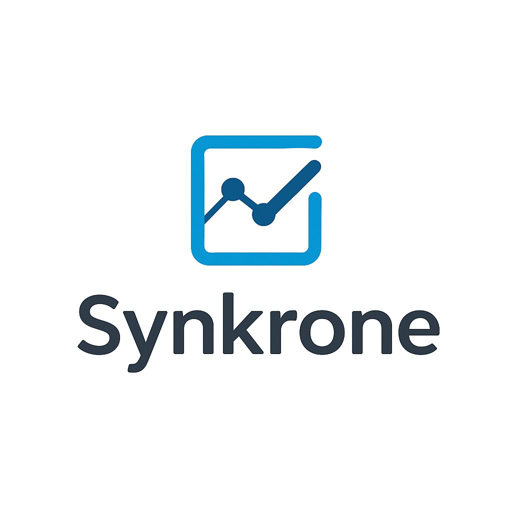

# Synkrone - Smart Appointment Scheduler

A comprehensive appointment management system built with Node.js, Express, and MongoDB, featuring role-based authentication, Google OAuth integration, hospital management, and AI-powered insights for modern healthcare scheduling.

## 🚀 Latest Updates & Features

### 🔐 Authentication & User Management
- **Multi-Role System**: Support for Patients, Doctors, and Administrators
- **Google OAuth Integration**: Seamless login with Google accounts
- **Role-Based Access Control**: Secure endpoints with proper authorization
- **Session Management**: Persistent sessions with MongoDB store
- **User Registration**: Comprehensive registration with role selection

### 🏥 Hospital Management System
- **Hospital Database**: Pre-seeded with major US hospitals (Mayo Clinic, Cleveland Clinic, Johns Hopkins, etc.)
- **Doctor-Hospital Association**: Doctors are linked to specific hospitals
- **Dynamic Hospital Selection**: Real-time hospital and doctor selection during registration
- **Hospital API**: RESTful endpoints for hospital data management

### 👩‍⚕️ Enhanced Doctor Portal
- **Professional Dashboard**: Comprehensive appointment overview with status tracking
- **Advanced Analytics**: Detailed performance metrics and completion rates
- **Appointment Management**: Accept, reject, complete appointments with notes
- **Real-time Status Updates**: Live appointment status management
- **Session Tracking**: Built-in timers for active consultations
- **Schedule Management**: Today's schedule and upcoming appointments
- **Doctor Notes**: Comprehensive patient consultation notes

### 👤 Patient Portal
- **Dashboard Overview**: View appointment statistics and recent activity
- **Smart Scheduling**: Book appointments with hospital and doctor selection
- **Appointment Management**: View, edit, and cancel appointments with ownership filtering
- **Health Tips**: Integrated health recommendations and tips
- **Responsive Design**: Mobile-friendly interface

### 🤖 AI Insights
- **Smart Analytics**: AI-powered appointment trends and predictions
- **Interactive Chat**: AI assistant for data insights and recommendations
- **Performance Metrics**: Detailed statistics on appointment patterns
- **Custom Reports**: Generate reports for different time periods
- **Revenue Tracking**: Monitor financial performance and projections

## 🛠️ Technology Stack

- **Backend**: Node.js, Express.js
- **Database**: MongoDB with Mongoose ODM
- **Authentication**: Passport.js (Local & Google OAuth 2.0)
- **Session Management**: Express Session with MongoDB store
- **Frontend**: EJS templating, Vanilla JavaScript
- **Styling**: Custom CSS with responsive design
- **Icons**: Bootstrap Icons
- **Charts**: Chart.js for data visualization
- **Security**: JWT tokens, bcrypt password hashing

## 📦 Installation

1. **Clone the repository**
   ```bash
   git clone <repository-url>
   cd Synkrone
   ```

2. **Install dependencies**
   ```bash
   npm install
   ```

3. **Environment Setup**
   Create a `.env` file with:
   ```env
   MONGODB_URI=mongodb://localhost:27017/zynk_appointments
   SESSION_SECRET=your_session_secret
   JWT_SECRET=your_jwt_secret
   GOOGLE_CLIENT_ID=your_google_client_id
   GOOGLE_CLIENT_SECRET=your_google_client_secret
   NODE_ENV=development
   ```

4. **Seed Hospital Data**
   ```bash
   node seedHospitals.js
   ```

5. **Start the application**
   ```bash
   npm start
   ```

6. **Access the application**
   - Open your browser and navigate to `http://localhost:3000`

## 🏗️ Project Structure

```
├── app.js                 # Main application file with middleware setup
├── package.json          # Dependencies and scripts
├── seedHospitals.js      # Hospital data seeding script
├── bin/
│   └── www               # Server startup script
├── config/
│   └── passport.js       # Passport authentication strategies
├── middleware/
│   └── auth.js           # JWT and role-based authentication middleware
├── models/
│   ├── index.js          # Model exports
│   ├── database.js       # Database connection
│   ├── appointment.js    # Enhanced appointment model with user/doctor/hospital refs
│   ├── users.js          # User model with roles and Google OAuth
│   └── hospital.js       # Hospital model
├── routes/
│   ├── index.js          # Main routes with Google OAuth and dashboard
│   ├── appointments.js   # Appointment CRUD with ownership filtering
│   ├── doctor.js         # Doctor portal with analytics and management
│   ├── insights.js       # AI insights routes
│   ├── users.js          # User API endpoints (register/login)
│   ├── doctors.js        # Doctor API endpoints
│   ├── hospitals.js      # Hospital API endpoints
│   └── auth.js           # Authentication routes
├── views/
│   ├── index.ejs         # Patient dashboard
│   ├── appointments.ejs  # Appointments listing with filters
│   ├── doctor.ejs        # Doctor portal dashboard
│   ├── insights.ejs      # AI insights dashboard
│   ├── login.ejs         # Login with Google OAuth button
│   ├── register.ejs      # Registration with role selection
│   ├── google-role-selection.ejs # Google OAuth role completion
│   ├── confirmation.ejs  # Booking confirmation
│   └── error.ejs         # Error page
├── public/
│   ├── stylesheets/
│   │   ├── style.css           # Main styles
│   │   ├── login.css           # Authentication page styles
│   │   ├── doctor-portal.css   # Doctor portal styles
│   │   ├── ai-insights.css     # AI insights styles
│   │   ├── homepage.css        # Homepage styles
│   │   └── appoitments.css     # Appointments page styles
│   ├── javascripts/
│   │   └── doctor-portal.js    # Doctor portal functionality
│   └── images/
│       └── logo.png            # Synkrone logo
```

## 📊 Enhanced Database Schema

### User Model (Enhanced)
```javascript
{
  user_id: String,           // Unique user identifier
  username: String,          // Username (unique)
  fullname: String,          // Full display name
  email: String,             // Email address (unique)
  googleId: String,          // Google OAuth ID (optional)
  avatar: String,            // Profile avatar URL
  role: String,              // 'user' | 'doctor' | 'admin'
  specialization: String,    // Doctor specialization (doctors only)
  hospitalId: ObjectId,      // Reference to Hospital (doctors only)
  createdAt: Date,
  updatedAt: Date
}
```

### Appointment Model (Enhanced)
```javascript
{
  userId: ObjectId,          // Reference to User (patient)
  doctorId: ObjectId,        // Reference to User (doctor)
  hospitalId: ObjectId,      // Reference to Hospital
  name: String,              // Patient name
  phone: String,             // Contact number
  date: String,              // Appointment date
  time: String,              // Appointment time
  type: String,              // 'regular' | 'urgent' | 'follow'
  status: String,            // 'pending' | 'confirmed' | 'in-progress' | 'completed' | 'cancelled' | 'approved' | 'rejected'
  notes: String,             // Patient notes
  doctorNotes: String,       // Doctor consultation notes
  rejectionReason: String,   // Reason for rejection (if applicable)
  resolvedAt: Date,          // Completion timestamp
  resolvedBy: String,        // Doctor who completed
  createdAt: Date,
  updatedAt: Date
}
```

### Hospital Model (New)
```javascript
{
  name: String,              // Hospital name (unique)
  location: String,          // Hospital location
  createdAt: Date,
  updatedAt: Date
}
```

## 🎯 Key Features

### Authentication & Authorization
- **Multiple Login Methods**: Local authentication and Google OAuth 2.0
- **Role-Based Access**: Different dashboards for patients, doctors, and admins
- **Secure Sessions**: MongoDB-backed session storage
- **Protected Routes**: JWT-based API authentication
- **User Registration**: Role selection during signup

### Appointment Management
- **Enhanced Booking**: Hospital and doctor selection integration
- **Status Tracking**: Multiple appointment states with transitions
- **Ownership Control**: Users can only access their own appointments
- **Advanced Filtering**: Search and filter by status, date, type
- **Real-time Updates**: Live status changes and notifications

### Hospital Integration
- **Hospital Network**: Pre-loaded with major US hospitals
- **Doctor Assignment**: Doctors associated with specific hospitals
- **Dynamic Loading**: Real-time hospital and doctor selection
- **API Integration**: RESTful endpoints for hospital data

### Doctor Workflow
- **Comprehensive Dashboard**: All appointment states in one view
- **Appointment Actions**: Accept, reject, start, complete appointments
- **Notes System**: Detailed consultation notes and patient history
- **Analytics Dashboard**: Performance metrics and trends
- **Schedule Management**: Today's and upcoming appointments

## 🔧 API Endpoints

### Authentication
- `POST /register` - User registration with role selection
- `POST /login` - Local authentication
- `GET /auth/google` - Google OAuth initiation
- `GET /auth/google/callback` - Google OAuth callback
- `POST /auth/google/complete` - Complete Google OAuth registration
- `GET /logout` - User logout

### Patient Portal
- `GET /dashboard` - Patient dashboard
- `POST /appointments` - Create appointment with hospital/doctor selection
- `GET /appointments` - View appointments with filters
- `PUT /appointments/:id` - Update appointment
- `DELETE /appointments/:id` - Cancel appointment

### Doctor Portal
- `GET /doctor` - Doctor dashboard with all appointment views
- `POST /doctor/update-status` - Update appointment status
- `POST /doctor/appointments/:id/accept` - Accept appointment  
- `POST /doctor/appointments/:id/reject` - Reject appointment
- `POST /doctor/appointments/:id/complete` - Complete appointment
- `GET /doctor/analytics` - Doctor performance analytics
- `GET /doctor/schedule/today` - Today's schedule
- `GET /doctor/schedule/upcoming` - Upcoming appointments

### Hospital & Doctor APIs
- `GET /api/hospitals` - Get all hospitals
- `GET /api/doctors?hospitalId=:id` - Get doctors by hospital

### User Management APIs
- `POST /api/auth/register` - API user registration
- `POST /api/auth/login` - API user login (returns JWT)

## 🎨 UI/UX Features

- **Modern Design**: Clean, professional interface with Synkrone branding
- **Responsive Layout**: Works on all device sizes
- **Interactive Elements**: Smooth animations and transitions
- **Color-coded Status**: Visual appointment status indicators
- **Real-time Updates**: Dynamic content updates without page refresh
- **Google OAuth UI**: Integrated Google sign-in buttons
- **Role-based Navigation**: Different interfaces for different user types
- **Accessibility**: Screen reader friendly components

## 🔒 Security Features

- **Multi-factor Authentication**: Local and OAuth providers
- **Password Hashing**: bcrypt for secure password storage
- **JWT Tokens**: Secure API authentication
- **Session Security**: HttpOnly cookies and CSRF protection
- **Role-based Authorization**: Endpoint protection by user role
- **Input Validation**: Comprehensive data validation and sanitization
- **Ownership Enforcement**: Users can only access their own data

## 📱 Responsive Design

The application is fully responsive with breakpoints for:
- **Desktop** (1200px+): Full-featured dashboards
- **Tablet** (768px - 1199px): Adapted layouts
- **Mobile** (< 768px): Touch-optimized interfaces

## 🚦 User Workflows

### Patient Registration & Booking
1. Register with email/password or Google OAuth
2. Select "Patient" role during registration
3. Access patient dashboard with appointment overview
4. Book appointment by selecting hospital and doctor
5. Track appointment status and receive updates

### Doctor Registration & Management  
1. Register with specialization and hospital assignment
2. Select "Doctor" role and provide medical credentials
3. Access comprehensive doctor dashboard
4. Review pending appointments and patient information
5. Accept/reject appointments and manage schedule
6. Update appointment status and add consultation notes
7. View analytics and performance metrics

### Google OAuth Flow
1. Click "Login/Register with Google"
2. Authenticate with Google account
3. Complete role selection (Patient/Doctor)
4. For doctors: select specialization and hospital
5. Redirect to appropriate dashboard

## 🤝 Contributing

1. Fork the repository
2. Create a feature branch (`git checkout -b feature/amazing-feature`)
3. Make your changes following the project structure
4. Test authentication flows and role-based access
5. Submit a pull request with detailed description

## 📄 License

This project is licensed under the MIT License - see the LICENSE file for details.

## 🐛 Known Issues & Improvements

### Current Limitations
- Real-time notifications system (in development)
- Email/SMS appointment reminders (planned)
- Advanced scheduling conflicts detection
- Multi-language support

### Planned Features
- [ ] Real-time push notifications
- [ ] Email/SMS integration with Twilio/SendGrid  
- [ ] Advanced calendar integration
- [ ] Video consultation platform
- [ ] Mobile application (React Native)
- [ ] Advanced analytics and reporting
- [ ] Multi-hospital admin dashboard
- [ ] Payment integration for consultations
- [ ] Prescription management system
- [ ] Patient medical history tracking

## 🔮 Technology Roadmap

### Phase 1 (Current)
- ✅ Core appointment scheduling
- ✅ Role-based authentication
- ✅ Google OAuth integration
- ✅ Hospital management system
- ✅ Doctor portal with analytics

### Phase 2 (Next Quarter)
- 🔄 Real-time notifications
- 🔄 Email/SMS integration
- 🔄 Advanced reporting system
- 🔄 Mobile-responsive enhancements

### Phase 3 (Future)
- 📋 Video consultation platform
- 📋 Mobile applications
- 📋 Advanced AI insights
- 📋 Multi-tenant architecture

## 📞 Support & Documentation

For support, feature requests, or bug reports:
- Open an issue in the GitHub repository
- Contact the development team
- Check the wiki for detailed documentation
- Review API documentation for integration guides

## 🏥 Pre-loaded Hospitals

The system comes with major US hospitals including:
- Mayo Clinic (Rochester, Minnesota)
- Cleveland Clinic (Cleveland, Ohio)  
- Johns Hopkins Hospital (Baltimore, Maryland)
- Massachusetts General Hospital (Boston, Massachusetts)
- Mount Sinai Hospital (New York, New York)
- UCLA Medical Center (Los Angeles, California)
- Stanford Health Care (Stanford, California)
- And many more...

## 🎖️ Credits

Built with modern web technologies and best practices for healthcare appointment management. Special thanks to the open-source community for the frameworks and libraries that make Synkrone possible.